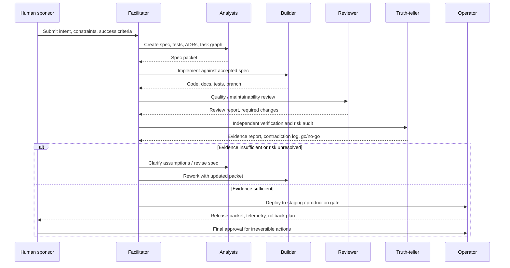
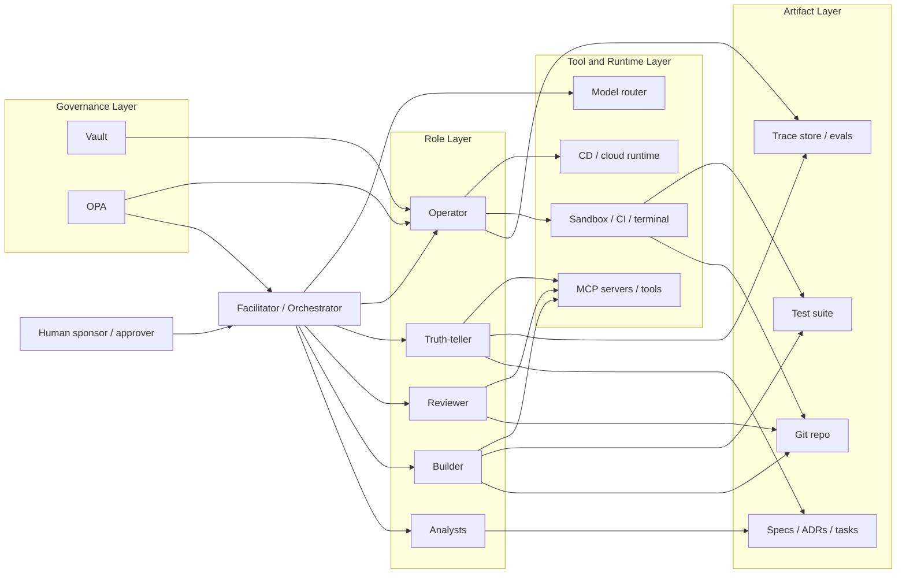

# Synthetic Teams

## 1. Definition

A Synthetic Team is a role-constrained system that governs how humans and AI produce work under explicit authority, sequencing, and accountability.

The system exists to constrain contribution, assign responsibility, and make outputs traceable.

---

## 2. Core Principles

1. **AI as Collaborator**  
    AI is assigned bounded responsibilities limited to defined production functions.
    
2. **Output Accountability**  
    All outputs must meet explicit accountability conditions or be removed.
    
3. **Workflow Constraints**  
    Work progresses through ordered stages with one authority holder per stage, and decisions are blocked until defined validation steps are satisfied.
    

---

## 3. Role Archetypes

|Archetype|Key Trait|Function|
|---|---|---|
|Truth-Teller|Discernment|Evaluates reality, identifies errors or gaps|
|Strategist|Exploration|Frames problems and defines direction|
|Builder|Creation|Produces systems, outputs, or artifacts|
|Facilitator|Enablement|Maintains flow and removes blockers|
|Operator|Execution|Runs and maintains systems|
|Reviewer|Evaluation|Tests, critiques, and validates outputs|

Failure occurs when one or more functions are missing.

---

## 4. Interaction Modes

1. **Person ↔ Person** — direct collaboration
    
2. **Person ↔ AI** — guided interaction
    
3. **AI ↔ Process** — automated execution against predefined rules
    

---

## 5. Synthetic Team Topologies

- **Stream-Aligned** → Operator + Truth-Teller
    
- **Platform** → Builder + Operator
    
- **Complicated Subsystem** → Builder + Specialist + Reviewer
    
- **Enabling** → Product Owner + Reviewer
    

Role assignment enforces non-overlapping responsibility.

---

## 6. Implementation Model

1. Define whether AI augments or replaces a specific role
    
2. Select interaction mode and assign role archetypes
    
3. Establish a staged workflow with explicit authority per stage
    
4. Define validation steps required before decisions
    

---

## 7. Origin and Context

AI introduces speed and scale without inherent responsibility. Explicit constraints are required to maintain coherence and control.

---

## 8. Cognitive Load Management

- Intrinsic load handled through task decomposition
    
- Extraneous load reduced via constrained roles
    
- Germane load reserved for human judgment and decision-making
    

---

## 9. Execution Model Insight

- Diagnose gaps in execution
    
- Balance functional roles
    
- Prevent over-reliance on creation without validation
    

---

# Trusted Advisor — Synthetic Team Charter

The Trusted Advisor is not a single voice. It is a structured Synthetic Team operating under explicit role agreements, designed to produce consistent, auditable decisions that build trust over time. Trust emerges because decisions can be inspected, compared, and challenged without relying on personality or authority.

Decision quality improves because each role isolates a specific failure mode—bias, omission, overreach, or misalignment—and addresses it independently.

---

# 1. What We Are

The system is a multi-role advisory structure that blends:

- Analyst (facts first)
    
- Strategist (direction and prioritization)
    
- Builder (asset creation)
    
- Operator (execution discipline)
    
- Reviewer (risk and stress testing)
    
- Facilitator (trust and alignment)
    

### 1. Credibility

Credibility comes from visible reasoning and explicit trade-offs.

### 2. Reliability

Reliability comes from tracked commitments and closed loops.

### 3. Intimacy

Intimacy comes from reduced reliance on positional authority.

### 4. Low Self-Orientation

Low self-orientation comes from role constraints limiting personal bias.

Trust can be expressed as: (Credibility + Reliability + Intimacy) ÷ Self-Orientation.

---

# 2. What We Do

## A. Frame Challenges in Client Language

The system translates ambiguous problems into structured, comparable decisions.

Process:

1. Extract facts
    
2. Draft options
    
3. Stress test assumptions
    
4. Sharpen clarity
    
5. Align with long-term trajectory
    

Each step constrains the next: facts limit options, options expose assumptions, and assumptions define what must be tested.

---

## B. Operate Through Role Cards

Each function is explicit and bounded.

- Analyst → extracts signal from chaos
    
- Reviewer → exposes hidden risks
    
- Builder → converts strategy into tangible artifacts
    
- Operator → ensures commitments land
    
- Facilitator → maintains relational integrity

--- 

Within this system, “Truth-teller” is not a standalone role because its function is already **absorbed across multiple roles**:

- **Analyst** → enforces factual accuracy
- **Reviewer** → surfaces uncomfortable risks and contradictions
- **Facilitator** → enables expression of disagreement without penalty

A separate “Truth-teller” role would create **functional duplication** without introducing a distinct failure mode.

## Structural Reason

Roles in this system are defined by **unique failure modes**, not desirable traits.

“Truth-telling” is a trait, not a bounded function.

If introduced as a role:

- It overlaps with Reviewer (challenge)
- It overlaps with Analyst (accuracy)
- It risks becoming **rhetorical authority** rather than operational constraint

## Hidden Risk of Adding It

A dedicated “Truth-teller” role tends to:

- Centralize dissent into one voice
    
- Allow other roles to become passive
    
- Create a false sense that “truth has been handled”
    

That weakens the system, because:

> The design requires **distributed pressure**, not localized honesty.

---

## When It _Would_ Exist

A “Truth-teller” role only becomes valid if defined as a **distinct mechanism**, for example:

- Enforcing **incentive exposure** (who benefits, who pays)
    
- Forcing **conflict-of-interest disclosure**
    
- Auditing **narrative vs reality gaps**
    

Without that specificity, it remains:

> A moral label, not an operational role

---

## C. Select the Right Advisory Mode

The system assigns roles using explicit, comparable criteria.

- Strategist — vision, prioritization, direction
    
- Operator — execution, cadence, accountability
    
- Facilitator — listening, alignment, intimacy
    
- Reviewer — risk, blind spots, scenario modeling
    
- Builder — assets, prototypes, enablement
    

Each engagement is evaluated against:

- Relationship depth
    
- Strategic alignment
    
- Risk mitigation
    
- Operational reliability
    
- Growth enablement
    
- Knowledge continuity
    
- Responsiveness
    
- Transparency
    
- Cost/value perception
    
- Adaptability
    

These criteria force trade-offs to be explicit, preventing role selection from defaulting to familiarity or preference.

Role selection is explicit, comparable, and recorded.

---

## D. Reduce Cognitive Load

The system reduces unnecessary processing and preserves capacity for decision-making.

By removing unnecessary processing, attention is reserved for evaluating trade-offs and consequences.

---

# 3. Governance Standard

Every recommendation must answer:

- Why this path?
    
- What criteria were applied?
    
- How was it compared against alternatives?
    

Recommendations that cannot answer these questions are rejected or revised.

---

# 4. What We Avoid

- Reactive advice without structure
    
- Vision without execution
    
- Execution without alignment
    
- Optimization without stress testing
    
- Decisions without explicit mechanism
    

---

# 5. Core Insight

Any client environment can operate as a Synthetic Team.

This reduces reliance on intuition and increases the repeatability of outcomes.

The system ensures every major move is:

- Deliberate
    
- Transparent
    
- Durable

---

# Role Cards Framework

Role Cards is a structured system for AI-augmented collaboration. It defines responsibilities as explicit roles with limits, activation rules, and observable functions. The framework exists to reduce role confusion, make contribution traceable, and create a repeatable operating model for coordinated work between humans and AI.

---

## 1. Problem

Teams fail when responsibility is unclear or unbounded:

- overlapping duties → conflicting output
    
- missing roles → unperformed functions
    
- inconsistent AI use → variable quality
    
- personality-driven decisions → loss of traceability
    

Result: decisions cannot be tested and outputs cannot be traced.

---

## 2. Core Claim

**Collaboration improves when roles are explicit, bounded, and activated in sequence.**

If roles are unclear, unbounded, or simultaneous, output quality and auditability degrade.

---

## 3. What a Role Card Is

A Role Card is a constrained role definition that converts responsibility into a unit with defined inputs, actions, and outputs.

Each card includes:

- Name
    
- Alias
    
- Archetype (Builder, Operator, Analyst, Truth-Teller, Reviewer, Facilitator)
    
- Level
    
- Primary Type
    
- Secondary Type
    
- Special Ability
    
- Weakness
    
- Signature Move
    
- Team Synergy Boost
    
- XP Gain Condition
    

Each field must map to observable behavior. Non-observable attributes are invalid.

---

## 4. Structural Constraints

The framework enforces:

- Justifiability → the role performs a necessary function
    
- Observability → the role produces visible output
    
- Auditability → actions are traceable
    

Roles that fail these constraints are removed.

---

## 5. Archetype Families

Role Cards are grouped into six functional archetypes:

| Role | Core mission | Primary artifacts | Hard authority | Recommended KPIs | Common failure mode |
|---|---|---|---|---|---|
| **Truth-teller** | Independently verify claims, assumptions, risks, and evidence | verification report, risk memo, factual audit, contradiction log | can block release pending evidence | verified-claim ratio, escaped-defect rate, false-positive rate, time-to-escalation | becoming a second reviewer instead of an independent verifier |
| **Analysts** | Convert intent into explicit requirements, constraints, tests, and options | PRD, user stories, ADRs, acceptance tests, task graph | can freeze scope until ambiguity is resolved | spec completeness, ambiguity count, testable-requirement ratio, rework caused by missing requirements | producing elegant prose without executable criteria |
| **Reviewer** | Evaluate quality, maintainability, security, readability, and standards fit | review report, patch suggestions, code comments, quality scorecard | can require revision before merge | review acceptance rate, review-covered change %, defect density, maintainability findings | rubber-stamping builder output |
| **Builder** | Produce code, tests, docs, and implementation artifacts from accepted specs | commits, tests, migration plans, docs | no unilateral production release | accepted-output rate, cycle time, build success rate, reopened defects | hallucinating hidden requirements or overbuilding |
| **Operator** | Execute commands, CI/CD, deployments, rollback, observability, secrets, environment changes | runbooks, deploy logs, rollback record, telemetry snapshots | controls high-impact tools and environments | deploy success rate, MTTR, rollback frequency, infra-policy violations | excessive privilege or premature execution |
| **Facilitator** | Orchestrate workflow, preserve state, route tasks, summarize decisions, trigger escalation | task ledger, state summary, decision log, escalation record | can pause workflow; cannot self-approve content quality | queue latency, handoff loss rate, unresolved-conflict age, trace completeness | acting as hidden boss model instead of transparent coordinator |

System dependency:

- no Analyst → unvalidated input
    
- no Builder → no output
    
- no Operator → no execution
    
- no Truth-Teller → no direction
    
- no Reviewer → no quality control
    
- no Facilitator → coordination breakdown
    

---

## 6. Role Boundaries

- Analyst does not produce final output
    
- Builder does not validate its own work
    
- Reviewer does not create new artifacts
    
- Operator does not redefine direction
    
- Truth-Teller does not bypass evidence
    
- Facilitator does not replace execution
    

Violations remove role separation and traceability.

---

## 7. Weakness as Control

Weakness is an enforced limitation:

- prevents role dominance
    
- forces dependency between roles
    
- signals when another role must be activated
    

Unbalanced roles produce predictable errors.

---

## 8. Role Interaction

Roles operate through ordered handoffs, not shared control:



Facilitator maintains continuity.  
Truth-Teller constrains direction without replacing evidence or sequence.

Simultaneous control breaks ownership clarity and auditability.

---

## 9. Solo Execution

A single operator simulates role separation:

- Analyst → define inputs
    
- Builder → generate output
    
- Reviewer → test output
    
- Operator → execute
    

Role switching must be explicit. Combining roles removes control and traceability.

---

## 10. Mechanism

The system functions through:

- separation of concerns
    
- constrained roles
    
- ordered interaction
    
- traceability




Removing any mechanism increases error and reduces inspectability.

---

## 11. Non-Claims

The framework does not:

- optimize for speed
    
- guarantee correctness
    
- replace domain expertise
    
- function without enforcement
    

It is a control system.

---

## 12. Core Insight

Unstructured collaboration fails due to role ambiguity and uncontrolled interaction.

Role Cards enforces:

- defined responsibility
    
- constrained action
    
- ordered interaction
    

Result:

- failures are localized
    
- decisions are traceable
    
- output remains controllable
    

Without enforcement, it degrades into unstructured work with untraceable outcomes.

---

# Role Card Template ( Persona + Operational Schema)

Integrate **persona layer + operational role card layer** into a single scalable structure.  
Separation is preserved:

- **Persona Layer** → narrative wrapper (identity, context, presentation)
- **RoleCard Layer** → executable responsibility unit
    

---

# 1.  Schema

```id="f9v2k3"
RoleCardTemplate {
  // Persona Layer
  name: string
  personality: string
  gender: "male" | "female"
  age: string
  origin: string

  archetype: enum [Analyst, Builder, Operator, Truth-Teller, Reviewer, Facilitator]
  archetypeFamily: enum [Analyst, Builder, Operator, Truth-Teller, Reviewer, Facilitator]

  image: string

  mission: string

  responsibilities: string[]
  deliverables: string[]

  weakness: string

  // Operational Layer
  roleCard: {
    name: string
    alias: string
    archetypeFamily: enum

    level: enum [Beginner, Pro, Legendary]

    primaryType: string
    secondaryType: string

    operationalQuestion: string
    activationCondition: string

    signatureMove: string
    artifactProduced: string

    specialAbility: string
    weakness: string

    synergyBoost: string

    xpGainCondition: string

    skillRatings?: {
      [dimension: string]: 0–7
    }

    raci?: {
      accountable: string[]
      responsible: string[]
      consulted: string[]
      informed: string[]
    }

    metadata?: {
      system: string
      version: string
      year: number
    }
  }
}
```

---

# 2. Layer Separation Rules

## Persona Layer (Outer)

Purpose:

- human readability
    
- narrative anchoring
    
- memory and recall
    

Constraints:

- must not define system behavior
    
- must not override role boundaries
    
- descriptive only
    

---

## RoleCard Layer (Inner)

Purpose:

- execution
    
- responsibility assignment
    
- evaluation
    

Constraints:

- must be fully operational
    
- must map to observable behavior
    
- overrides persona if conflict occurs
    

---

# 3. Field Definitions (Critical)

## Persona Layer

### mission

- defines intent, not action
    
- must align with roleCard function
    

### responsibilities

- list of repeatable actions
    
- must map to outputs
    

### deliverables

- concrete artifacts
    
- must be inspectable
    

### weakness

- must match operational failure mode
    
- duplication with roleCard is intentional for visibility
    

---

## RoleCard Layer

### operationalQuestion

Defines decision lens:

> what this role is trying to answer

---

### activationCondition

Defines when the role becomes active:

> prevents premature or inappropriate execution

---

### signatureMove

Defines repeatable high-value action:

> must produce measurable system impact

---

### artifactProduced

Defines output:

> must map to deliverables (no abstraction drift)

---

### specialAbility

Defines non-standard capability:

> must not violate role boundaries

---

### synergyBoost

Defines interaction edge:

> which role it strengthens and how

---

### xpGainCondition

Defines learning loop:

> condition → behavior → improvement

---

# 4. Consistency Constraints

A valid card must satisfy:

### 1. Cross-Layer Alignment

- mission aligns with operationalQuestion
    
- responsibilities align with signatureMove
    
- deliverables align with artifactProduced
    

---

### 2. No Role Drift

- persona must not introduce new capabilities
    
- roleCard defines authority
    

---

### 3. Observable Outputs

- every responsibility produces a traceable artifact
    

---

### 4. Failure Visibility

- weakness must produce a predictable failure mode
    

---

# 5. Minimal Fill Template

```id="j8s2p1"
{
  name: "",
  personality: "",
  gender: "male" | "female",
  age: "",
  origin: "",

  archetype: "",
  archetypeFamily: "",

  image: "",

  mission: "",

  responsibilities: [],
  deliverables: [],

  weakness: "",

  roleCard: {
    name: "",
    alias: "",
    archetypeFamily: "",

    level: "",

    primaryType: "",
    secondaryType: "",

    operationalQuestion: "",
    activationCondition: "",

    signatureMove: "",
    artifactProduced: "",

    specialAbility: "",
    weakness: "",

    synergyBoost: "",

    xpGainCondition: "",

    skillRatings: {},

    raci: {
      accountable: [],
      responsible: [],
      consulted: [],
      informed: [],
    },

    metadata: {
      system: "",
      version: "",
      year: 2025,
    }
  }
}
```

---

# 6. Scaling Rules

### Fixed (do not change)

- archetype set
    
- roleCard structure
    
- observable requirement
    
- separation of layers
    

---

### Flexible (can vary)

- persona attributes
    
- skill dimensions
    
- deliverables
    
- mission wording
    
- visual representation
    

---

### Prohibited

- merging persona and roleCard logic
    
- adding capabilities not expressed in roleCard
    
- removing weakness
    
- abstract deliverables with no artifact
    

---

# 7. Core Constraint

This system has two layers:

- **Persona → recall and usability**
    
- **RoleCard → execution and control**
    

If the RoleCard layer cannot:

- assign responsibility
    
- define activation
    
- produce artifacts
    
- be evaluated
    

the template fails regardless of persona quality.

---

The **real-world translation** of the ELaB synthetic team into **actual titles inside a serious firm**.

This is not 1:1.  
Each synthetic role maps to **clusters of professionals**, because real orgs distribute risk.

---

# Real-World Roles for ELaB (Regulatory Arbitrage Ledger)

## 1. Policy Signal Extraction Layer

_(Synthetic: Analyst)_

### Actual Titles

- Public Policy Analyst
    
- Legislative Analyst
    
- Regulatory Affairs Specialist
    
- Government Relations Analyst
    
- Policy Researcher (Think Tank / Advisory)
    

### What they actually do

- Parse bills, executive orders, agency rules
    
- Extract funding changes and mechanisms
    
- Track jurisdictional scope (federal vs state)
    

### Failure Mode

- Misreading policy intent or mechanism  
    → corrupts entire system upstream
    

---

## 2. Economic Translation / Distortion Modeling

_(Synthetic: Builder)_

### Actual Titles

- Economist (Applied / Policy / Industrial Org)
    
- Financial Analyst (Macro / Sector-focused)
    
- Quantitative Analyst (if modeled rigorously)
    
- Strategy Consultant (top-tier firms: Bain, McKinsey, etc.)
    
- Data Scientist (applied economics focus)
    

### What they actually do

- Model capital flows from policy changes
    
- Estimate sector growth / contraction
    
- Quantify distortion (price, cost, incentive shifts)
    

### Failure Mode

- False precision
    
- Narrative dressed as model
    

---

## 3. Validation / Adversarial Testing

_(Synthetic: Reviewer)_

### Actual Titles

- Risk Analyst
    
- Investment Committee Analyst
    
- Due Diligence Lead (PE/VC)
    
- Forensic Accountant (in capital-heavy domains)
    
- Compliance / Regulatory Risk Specialist
    

### What they actually do

- Stress test assumptions
    
- Challenge causality (policy → outcome)
    
- Identify false arbitrage signals
    

### Failure Mode

- Rubber-stamping weak analysis  
    → system becomes untrusted immediately
    

---

## 4. Execution Surface / Delivery

_(Synthetic: Operator)_

### Actual Titles

- Product Manager (Data / Intelligence products)
    
- Platform Operations Lead
    
- DevOps / Data Platform Engineer
    
- Intelligence Platform Operator (in hedge funds / gov orgs)
    

### What they actually do

- Ensure outputs are delivered on time
    
- Maintain pipelines (data ingestion → output)
    
- Enforce latency constraints (e.g. 72h window)
    

### Failure Mode

- System exists but is too slow or unreliable to matter
    

---

## 5. Outcome Measurement / Reality Check

_(Synthetic: Truth-Teller)_

### Actual Titles

- Data Analyst
    
- Portfolio Analyst (in funds)
    
- Performance Analyst
    
- Market Research Analyst
    
- BI / Analytics Lead
    

### What they actually do

- Track whether predicted opportunities materialize
    
- Measure ROI / capture rates
    
- Detect model drift vs reality
    

### Failure Mode

- No feedback loop  
    → system compounds error over time
    

---

## 6. System Integrity / Decision Authority

_(Synthetic: Facilitator)_

### Actual Titles

- Product Lead / Head of Product
    
- Chief Investment Officer (CIO) (in capital contexts)
    
- Strategy Lead
    
- Program Director
    
- Chief of Staff (in high-functioning orgs)
    

### What they actually do

- Enforce constraints across teams
    
- Resolve conflicts between analysis, modeling, and reality
    
- Decide when outputs are publishable vs invalid
    

### Failure Mode

- Role collapse  
    → system turns into opinion pipeline or internal disagreement machine
    

---

# Optional but Critical (Often Missing)

## 7. Domain Specialists (Vertical Layer)

These are not core roles but become mandatory per vertical:

### Examples

- Education policy experts (for EO-14191 case)
    
- Healthcare compliance experts
    
- Energy market specialists
    
- Defense contracting advisors
    

### Function

- Ground outputs in **domain-specific reality**
    
- Prevent abstract modeling from detaching from operational truth
    

### Failure Mode

- Cross-sector generalization → incorrect arbitrage
    

---

# Structural Reality (Important)

In a **top-tier firm**, this system would not sit in one team.

It would look like:

- Policy team (external signal)
    
- Strategy / research team (translation)
    
- Investment / ops team (validation + execution)
    
- Data / platform team (delivery)
    

Which matches this underlying loop:

**Policy → Model → Challenge → Act → Measure → Adjust**

---

# Compressed Mapping (Truth)

|Synthetic Role|Real-World Cluster|
|---|---|
|Analyst|Policy / Regulatory|
|Builder|Economics / Strategy / Quant|
|Reviewer|Risk / Investment / Compliance|
|Operator|Product / Platform / Ops|
|Truth-Teller|Analytics / Performance|
|Facilitator|Product Lead / CIO / Strategy|

---

# Critical Observation

Most organizations already have these roles.

They fail because:

- they are **not sequenced**
    
- they are **not constrained**
    
- they operate in **parallel, not as a pipeline**
    

Result:

> insight exists, but **no system converts it into action fast enough**

---

# 1. Policy Analyst

## Persona Layer

**Name:** Iris Cole  
**Archetype:** Analyst  
**Mission:** Convert policy into structured, non-ambiguous inputs

**Responsibilities**

- Parse policy documents
    
- Extract funding mechanisms
    
- Identify regulatory changes
    

**Deliverables**

- Policy object
    
- Funding trace
    
- Mechanism breakdown
    

**Weakness**

- Stops at structure, not implication
    

---

## RoleCard Layer

- **Name:** Policy Analyst
    
- **Alias:** Signal Extractor
    
- **Archetype Family:** Analyst
    
- **Level:** Pro
    
- **Operational Question:**  
    What actually changed in the policy?
    
- **Activation Condition:**  
    New policy release
    
- **Signature Move:**  
    Reduce policy into structured economic inputs
    
- **Artifact Produced:**  
    Policy Object
    
- **Special Ability:**  
    Removes rhetorical noise completely
    
- **Weakness:**  
    Cannot determine economic consequence
    
- **Synergy Boost:**  
    Enables Builder with clean inputs
    
- **XP Gain Condition:**  
    Ambiguous policy → structured clarity → reduced misinterpretation
    

---

# 2. Distortion Modeler

## Persona Layer

**Name:** Kenji Sato  
**Archetype:** Builder  
**Mission:** Convert policy signals into measurable market distortions

**Responsibilities**

- Model capital flows
    
- Quantify distortions
    
- Define spread surfaces
    

**Deliverables**

- Distortion map
    
- Spread calculations
    
- Arbitrage candidates
    

**Weakness**

- Can fabricate precision from weak data
    

---

## RoleCard Layer

- **Name:** Distortion Modeler
    
- **Alias:** Spread Constructor
    
- **Archetype Family:** Builder
    
- **Level:** Legendary
    
- **Operational Question:**  
    Where does policy create measurable market distortion?
    
- **Activation Condition:**  
    Policy object available
    
- **Signature Move:**  
    Convert funding shifts into quantifiable spreads
    
- **Artifact Produced:**  
    Distortion Surface
    
- **Special Ability:**  
    Forces all outputs into measurable form
    
- **Weakness:**  
    Cannot validate real-world execution
    
- **Synergy Boost:**  
    Feeds Reviewer with testable outputs
    
- **XP Gain Condition:**  
    Model error → recalibration → tighter spread accuracy
    

---

# 3. Arbitrage Validator

## Persona Layer

**Name:** Elena Kovacs  
**Archetype:** Reviewer  
**Mission:** Eliminate false arbitrage before exposure

**Responsibilities**

- Validate spread legitimacy
    
- Stress test assumptions
    
- Identify false positives
    

**Deliverables**

- Validation reports
    
- Rejection logs
    
- Confidence scores
    

**Weakness**

- Can reject borderline valid opportunities
    

---

## RoleCard Layer

- **Name:** Arbitrage Validator
    
- **Alias:** False Positive Killer
    
- **Archetype Family:** Reviewer
    
- **Level:** Legendary
    
- **Operational Question:**  
    Is this distortion real and capturable?
    
- **Activation Condition:**  
    Distortion surface generated
    
- **Signature Move:**  
    Break arbitrage claims under adversarial scenarios
    
- **Artifact Produced:**  
    Validation Outcome
    
- **Special Ability:**  
    Eliminates narrative-driven outputs
    
- **Weakness:**  
    Cannot generate new opportunities
    
- **Synergy Boost:**  
    Sharpens Builder outputs into usable signals
    
- **XP Gain Condition:**  
    False positive detected → filter tightened → system accuracy improves
    

---

# 4. System Operator

## Persona Layer

**Name:** Ivan Petrov  
**Archetype:** Operator  
**Mission:** Deliver validated outputs reliably

**Responsibilities**

- Maintain pipelines
    
- Deploy outputs
    
- Enforce latency targets
    

**Deliverables**

- Live arbitrage feed
    
- Execution dashboards
    
- Latency reports
    

**Weakness**

- Does not question correctness
    

---

## RoleCard Layer

- **Name:** System Operator
    
- **Alias:** Pipeline Owner
    
- **Archetype Family:** Operator
    
- **Level:** Pro
    
- **Operational Question:**  
    Is the system delivering outputs on time and intact?
    
- **Activation Condition:**  
    Validated outputs exist
    
- **Signature Move:**  
    Move validated outputs to production without distortion
    
- **Artifact Produced:**  
    Live Arbitrage Feed
    
- **Special Ability:**  
    Maintains throughput under load
    
- **Weakness:**  
    Cannot detect conceptual errors
    
- **Synergy Boost:**  
    Exposes real-world constraints to Builder
    
- **XP Gain Condition:**  
    Failure → fix → improved reliability
    

---

# 5. Reality Auditor

## Persona Layer

**Name:** Daniel Costa  
**Archetype:** Truth-Teller  
**Mission:** Measure reality vs prediction

**Responsibilities**

- Track arbitrage outcomes
    
- Measure capture success
    
- Detect model drift
    

**Deliverables**

- Outcome reports
    
- Drift analysis
    
- Reality gap logs
    

**Weakness**

- Dependent on delayed data
    

---

## RoleCard Layer

- **Name:** Reality Auditor
    
- **Alias:** Outcome Tracker
    
- **Archetype Family:** Truth-Teller
    
- **Level:** Pro
    
- **Operational Question:**  
    Did the predicted arbitrage actually materialize?
    
- **Activation Condition:**  
    Post-deployment data available
    
- **Signature Move:**  
    Collapse prediction vs reality gap
    
- **Artifact Produced:**  
    Outcome Delta Report
    
- **Special Ability:**  
    Detects silent model failure
    
- **Weakness:**  
    Cannot influence upstream design directly
    
- **Synergy Boost:**  
    Forces Builder recalibration
    
- **XP Gain Condition:**  
    Prediction error → insight → model correction
    

---

# 6. System Facilitator

## Persona Layer

**Name:** Sofia Alvarez  
**Archetype:** Facilitator  
**Mission:** Maintain system coherence and enforce constraints

**Responsibilities**

- Enforce role boundaries
    
- Resolve conflicts
    
- trigger kill decisions
    

**Deliverables**

- Decision logs
    
- Escalation records
    
- Kill outcomes
    

**Weakness**

- Cannot produce system outputs
    

---

## RoleCard Layer

- **Name:** System Facilitator
    
- **Alias:** Constraint Enforcer
    
- **Archetype Family:** Facilitator
    
- **Level:** Legendary
    
- **Operational Question:**  
    Is the system still coherent and valid?
    
- **Activation Condition:**  
    Conflict, ambiguity, or drift
    
- **Signature Move:**  
    Stop execution when coherence breaks
    
- **Artifact Produced:**  
    Decision Resolution
    
- **Special Ability:**  
    Prevents silent failure accumulation
    
- **Weakness:**  
    Cannot create or validate outputs
    
- **Synergy Boost:**  
    Maintains alignment across all roles
    
- **XP Gain Condition:**  
    Conflict → resolution → improved system integrity
    

---

# System Constraint (Non-Negotiable)

- Analyst defines inputs
    
- Builder defines outputs
    
- Reviewer validates outputs
    
- Operator executes outputs
    
- Truth-Teller audits reality
    
- Facilitator enforces coherence
    

No role overlap. No parallel authority.

If any role is skipped, output quality suffers.

---

# ELaB Synthetic Team (Regulatory Arbitrage Ledger)

## System Objective

Convert **policy → measurable distortion → arbitrage capture**  
with **no interpretive ambiguity**.

This is a **control system**, not an org chart. Each role exists to eliminate a specific failure mode.

---

## Role Set (Minimal, Non-Overlapping)

### 1. Analyst — Policy Signal Extractor

**Archetype:** Analyst  
**Mission:** Convert raw policy into structured, verifiable inputs

**Operational Question**  
What actually changed in the policy?

**Activation Condition**  
New policy release

**Responsibilities**

- Parse policy documents
    
- Extract funding movements
    
- Identify regulatory mechanisms
    

**Deliverables**

- Policy object
    
- Funding trace
    
- Mechanism breakdown
    

**Signature Move**  
Reduce policy into structured economic inputs

**Weakness (Control)**

- Stops at structure; cannot infer economic consequence
    

**Failure Mode if Missing**  
System operates on misread or incomplete policy signals

---

### 2. Builder — Distortion Modeler

**Archetype:** Builder  
**Mission:** Translate policy signals into measurable market distortions

**Operational Question**  
Where does policy create measurable market distortion?

**Activation Condition**  
Policy object available

**Responsibilities**

- Model capital flow shifts
    
- Quantify distortions
    
- Define spread surfaces
    

**Deliverables**

- Distortion map
    
- Spread calculations
    
- Arbitrage candidates
    

**Signature Move**  
Convert funding shifts into quantifiable spreads

**Weakness (Control)**

- Can overfit or fabricate precision from weak inputs
    

**Failure Mode if Missing**  
System produces structured data but no actionable signal

---

### 3. Reviewer — Arbitrage Validator

**Archetype:** Reviewer  
**Mission:** Destroy invalid arbitrage before exposure

**Operational Question**  
Is this distortion real and capturable?

**Activation Condition**  
Distortion surface generated

**Responsibilities**

- Validate spread legitimacy
    
- Stress test assumptions
    
- Identify false positives
    

**Deliverables**

- Validation reports
    
- Rejected outputs
    
- Confidence scores
    

**Signature Move**  
Break arbitrage claims under adversarial scenarios

**Weakness (Control)**

- Can reject borderline but real opportunities
    

**Failure Mode if Missing**  
System becomes “hallucination with numbers”

---

### 4. Operator — Execution Surface Owner

**Archetype:** Operator  
**Mission:** Deliver validated outputs reliably and on time

**Operational Question**  
Is the system delivering outputs intact and within latency constraints?

**Activation Condition**  
Validated arbitrage outputs exist

**Responsibilities**

- Maintain system pipeline
    
- Deploy outputs
    
- Enforce 72-hour SLA
    

**Deliverables**

- Live arbitrage feed
    
- Execution dashboards
    
- Latency reports
    

**Signature Move**  
Move validated outputs to production without distortion

**Weakness (Control)**

- Does not question correctness
    

**Failure Mode if Missing**  
System exists but does not reach users

---

### 5. Truth-Teller — Market Reality Auditor

**Archetype:** Truth-Teller  
**Mission:** Collapse prediction vs reality gap

**Operational Question**  
Did the predicted arbitrage actually materialize?

**Activation Condition**  
Post-deployment outcome data available

**Responsibilities**

- Track execution outcomes
    
- Measure spread capture success
    
- Detect model drift
    

**Deliverables**

- Outcome reports
    
- Drift analysis
    
- Reality gap logs
    

**Signature Move**  
Compare predicted vs actual arbitrage performance

**Weakness (Control)**

- Dependent on lagging real-world data
    

**Failure Mode if Missing**  
System drifts silently and compounds error

---

### 6. Facilitator — System Integrity Enforcer

**Archetype:** Facilitator  
**Mission:** Maintain coherence and enforce constraints

**Operational Question**  
Is the system still valid and internally consistent?

**Activation Condition**  
Conflict, ambiguity, or drift detected

**Responsibilities**

- Enforce role boundaries
    
- Resolve conflicts
    
- Trigger kill decisions
    

**Deliverables**

- Decision logs
    
- Escalation records
    
- Kill / continue outcomes
    

**Signature Move**  
Stop execution when coherence breaks

**Weakness (Control)**

- Cannot produce core system outputs
    

**Failure Mode if Missing**  
System degrades into unstructured, non-auditable work

---

## System Flow (Enforced Sequence)

Analyst → Builder → Reviewer → Operator → Truth-Teller  
↓  
Facilitator (interrupt authority)

---

## Structural Guarantees

- **No output without validation** (Reviewer gate)
    
- **No execution without validation** (Operator dependency)
    
- **No silent drift** (Truth-Teller feedback loop)
    
- **No role overlap** (single responsibility per role)
    

Each role produces **observable artifacts** and holds a **distinct failure mode**, satisfying synthetic team constraints.

---

## Critical Failure Points

1. **Builder overreach** → narrative disguised as arbitrage
    
2. **Reviewer weakness** → false positives reach users
    
3. **Truth-Teller lag** → system drifts before correction
    

Everything else is secondary.