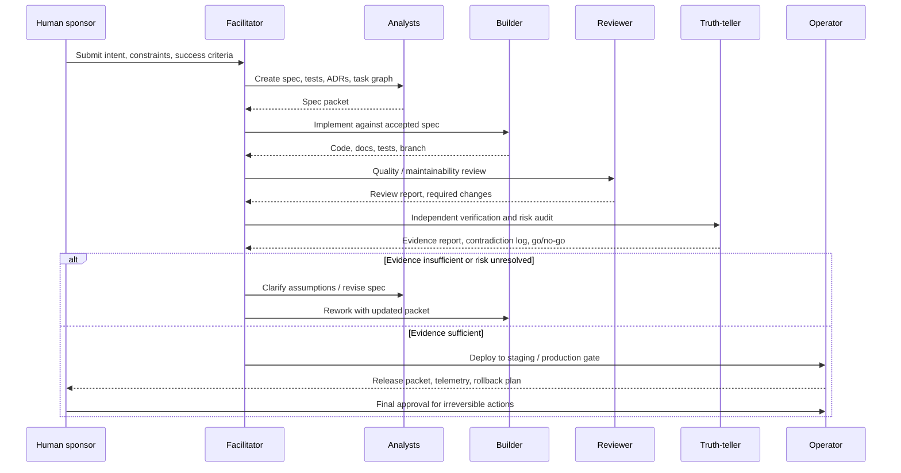
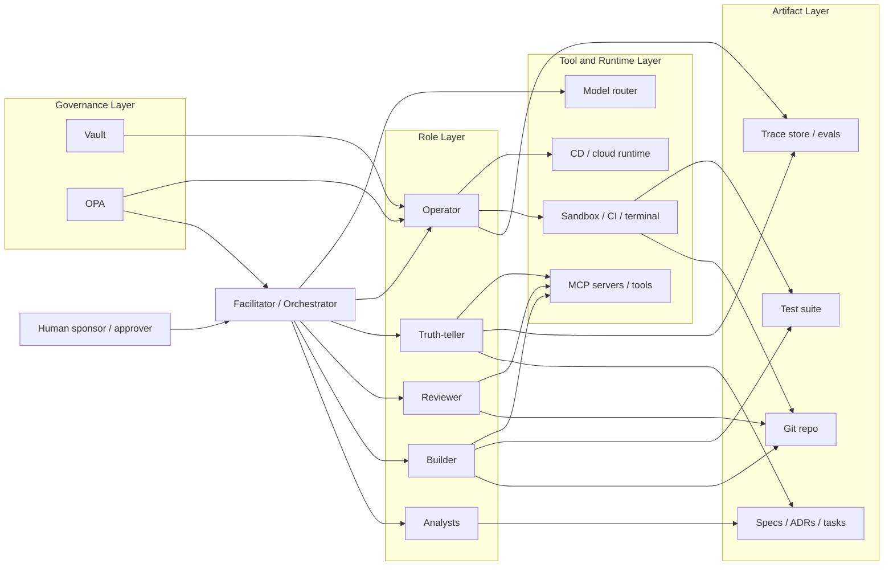

# Synthetic Teams for Structured Human+AI Working Groups 

## Executive Summary

This paper examines **synthetic teams** as deliberately structured human+AI working groups in which roles, decision rights, tools, and review gates are separated by design. The framing draws on human-autonomy teaming research, role-based agent frameworks (ChatDev, MetaGPT), and current production tooling that lets agents plan, code, review, and open pull requests inside bounded environments.

The original idea was that early Silicon Valley teams often used these implicitly. People weren't hired as "QA", "CTO", or "Product Manager" first. They occupied cognitive roles needed by the company at that stage. Titles came later. Archetypes came first.

This report treats the six-role taxonomy—**truth-teller, analysts, reviewer, builder, operator, facilitator**—as the governing design brief and synthesizes it against primary sources.

In human-autonomy teaming research, synthetic teams could match all-human teams at mission level while processing work less efficiently; proactive communication helps only when accurate and calibrated to task complexity.

A notable case study reports a senior engineer supported by specialized AI agents under a spec-driven workflow absorbing work scoped for a multi-person squad in roughly half the planned time. The paper's conclusion: success depended more on specification quality and institutional knowledge than on raw model capability.

## Definition and Thesis

**Thesis:** Synthetic teams derive most of their value from explicit role separation and artifact-centered coordination under human accountability.

This governs everything that follows. Remaining sections supply mechanisms, evidence, implementation options, and limitations.

## Why Role Separation Works

### Accountability

Irreversible actions require human ownership. Role separation makes this boundary explicit: the operator controls execution surfaces, the truth-teller independently verifies safety, and the human sponsor retains final approval for costly or regulated decisions. This reflects how LangGraph's interrupt primitives and GitHub's branch/PR workflows already enforce approval gates.

### Verification

Generation and evaluation are different cognitive tasks. Research on Self-Refine, Reflexion, Chain-of-Verification, and Constitutional AI indicates that explicit critique, revision, and independent verification materially improve output quality. A synthetic team becomes epistemically useful when at least one role questions the others using different prompts, evidence, and execution paths.

### Coordination

MetaGPT encodes SOPs into prompt sequences. ChatDev models a software company as specialized agents. GitHub Spec Kit turns requirements into a progression through specs, plans, and tasks. In each case, the durable artifact—not the chat transcript—carries work across handoffs. citeturn6search2turn6search9turn21search3turn21search9 Empirical work supports this: *Grounded Copilot* found programmers most effective in acceleration mode where the human already knew what to do.

## Six Roles

| Role | Core mission | Primary artifacts | Hard authority | Recommended KPIs | Common failure mode |
|---|---|---|---|---|---|
| **Truth-teller** | Independently verify claims, assumptions, risks, and evidence | verification report, risk memo, factual audit, contradiction log | can block release pending evidence | verified-claim ratio, escaped-defect rate, false-positive rate, time-to-escalation | becoming a second reviewer instead of an independent verifier |
| **Analysts** | Convert intent into explicit requirements, constraints, tests, and options | PRD, user stories, ADRs, acceptance tests, task graph | can freeze scope until ambiguity is resolved | spec completeness, ambiguity count, testable-requirement ratio, rework caused by missing requirements | producing elegant prose without executable criteria |
| **Reviewer** | Evaluate quality, maintainability, security, readability, and standards fit | review report, patch suggestions, code comments, quality scorecard | can require revision before merge | review acceptance rate, review-covered change %, defect density, maintainability findings | rubber-stamping builder output |
| **Builder** | Produce code, tests, docs, and implementation artifacts from accepted specs | commits, tests, migration plans, docs | no unilateral production release | accepted-output rate, cycle time, build success rate, reopened defects | hallucinating hidden requirements or overbuilding |
| **Operator** | Execute commands, CI/CD, deployments, rollback, observability, secrets, environment changes | runbooks, deploy logs, rollback record, telemetry snapshots | controls high-impact tools and environments | deploy success rate, MTTR, rollback frequency, infra-policy violations | excessive privilege or premature execution |
| **Facilitator** | Orchestrate workflow, preserve state, route tasks, summarize decisions, trigger escalation | task ledger, state summary, decision log, escalation record | can pause workflow; cannot self-approve content quality | queue latency, handoff loss rate, unresolved-conflict age, trace completeness | acting as decider instead of transparent coordinator |

**Truth-teller** is an epistemic control function—contradiction checks, evidence ranking, claim verification, and risk escalation separate from style review—motivated by CoVe and trust/calibration findings.

**Analysts** are plural because the function frequently splits into domain, technical, and evaluation analysis. They front-load acceptance criteria and ADRs.

**Reviewer** and **truth-teller** remain separate even when one human fills both jobs. Review asks, "Is this good software?" Truth-telling asks, "Is this actually true, evidenced, safe?"

**Builder** is measured by acceptance and rework, not token volume or completion speed.

**Operator** exists because coding agents increasingly control real execution surfaces. Claude Code, GitHub Copilot cloud agent, and OpenHands all execute commands. 

**Facilitator** maps to LangGraph stateful control, AutoGen teams/AgentChat, or a lightweight coordinator tracking task state and escalation boundaries. 

## Interaction Protocols

### Artifacts

Artifact-first, chat-second. Conversation discovers ideas; committed artifacts move work between roles: intent packet, spec packet, implementation branch, review report, verification memo, release packet.



**Packet types:** intent (problem, constraints, metrics), spec (requirements, tests, ADRs), build (branch, notes, results), review (findings, suggestions), truth (claim audit, evidence table, confidence), release (diff, approvals, rollback plan).

### Conflict Resolution

Resolve by ranking evidence: executable tests > repository facts > versioned specs/ADRs > trusted external docs > model assertions. This follows from CoVe and observability practice. 

When reviewer and truth-teller disagree, the facilitator produces a decision memo (disputed claim, evidence, residual risk, next action). Issues affecting security, privacy, production reliability, or legal exposure escalate to a human DRI.

### Decision Rights

- **Reversible decisions:** delegate with logging.
- **Costly but reversible:** reviewer plus operator concurrence.
- **Irreversible or regulated:** explicit human approval after truth-teller sign-off.

This reflects the human-in-the-loop pattern in LangGraph and current coding-agent PR workflows.

## Reference Architectures

### Guided human+AI cell

One human lead owns approval and may fill facilitator duties. AI fills analyst, builder, reviewer, and truth-teller roles. Operator privileges are bounded to staging. Closest to how Claude Code, Copilot, and spec-driven workflows are used today. 

### Hybrid squad with orchestrator

The facilitator becomes an orchestration service. LangGraph provides durable execution and human-in-the-loop control; AutoGen provides teams and agent patterns; CrewAI provides event-driven flows. State, routing, and pauses become first-class features. 

### Enterprise control plane

A model-agnostic platform: OpenHands for autonomous engineering work; LiteLLM as unified model gateway; vLLM for distributed inference; Temporal for crash-proof workflow execution; OpenTelemetry with Phoenix for traces and evaluations; OPA and Vault for policy and secrets. 



Two design rules: (1) the repository and versioned specs are canonical memory—vector retrieval and caches are accelerators but should not outrank source-controlled artifacts; (2) tool access is role-scoped—operator owns credentials and deployment, builder writes in a sandbox, truth-teller has read access and scanner access but minimal destructive power. 

## Implementation Patterns

Spec-driven development (GitHub Spec Kit structures work as requirements → spec → plan → tasks), plan-implement-review separation (Copilot cloud agent plans/branches/opens PRs; code review evaluates diffs), parallel bounded execution (Claude Code for independent tasks with visible state and easy review), and externalized evaluation (OpenHands evaluates ability, cost, and runtime). 

## Case Studies

The following are illustrative, not proof.

**GitHub Spec Kit and Copilot.** Specification-first with the cloud agent researching, planning, changing branches, and creating PRs. Analysis, implementation, review, and workflow control are separate functions.

**Anthropic internal engineering.** Teams use Claude Code for debugging, unfamiliar codebases, and internal tools. The Security Engineering team used it for production issue tracing. Builder, reviewer, and operator functions are separated over a common harness. 

**OpenHands.** Publishes an evaluation harness and benchmark framework for real software-engineering work. A role-capable, model-agnostic agent platform. Agents may excel at bounded tasks, but Commit0 evaluations show they cannot fully reproduce complete libraries from scratch.

**One-person squad.** The 2026 paper found a senior engineer with specialized AI agents under a spec-driven workflow could absorb work scoped for a small squad—provided the human wrote precise specs and supplied institutional knowledge.

**ChatDev and MetaGPT.** Formalize role-based collaboration: ChatDev organizes software-company roles through chat chains; MetaGPT encodes SOPs into prompt sequences. Both supply a basis for the six-role model.

**Scope.** Synthetic teams are easiest to introduce where scope, context, and interfaces are bounded—for example, greenfield projects, isolated products, contained domains, internal tooling, and modular subsystems. Greenfield is one such environment, not a privileged one. Commit0 and "Vibe Coding Ate My Homework" confirm that from-scratch generation hits ceilings on complex software.

## Metrics

| Dimension | Core metric | Good signal |
|---|---|---|
| **Performance** | cycle time per accepted work item | falling cycle time without rising reopen rate |
| **Quality** | escaped defects per release | stable defect escape at same release volume |
| **Truthfulness** | verified-claim ratio | high sign-off rate with low contradiction rate |
| **Reliability** | deploy success rate and MTTR | high success, low rollback, fast recovery |
| **Safety / security** | policy violations, vuln findings | low violation rate, quick remediation |
| **Human leverage** | review minutes per accepted item | less routine effort, not less accountability |
| **Cost** | token/compute/tool cost per accepted item | cost falls faster than quality or latency rises |
| **Coordination** | handoff loss and conflict age | low stale conflicts, high trace completeness |

Instrumentation baseline: traces + artifacts + evaluation outcomes. OpenTelemetry, Phoenix, and OpenHands' benchmark framing cover the minimum useful telemetry. 

## Deployment Roadmap

**Prepare.** Choose a bounded pilot, write a constitution, define approval boundaries, assign six roles even if one human fills several. 

**Mandate artifacts.** Intent packet, spec packet, acceptance tests, branch implementation, review report, truth report, release packet for every work item.

**Instrument.** Traces, state logs, and evaluation capture before metrics are needed. OpenTelemetry and Phoenix are a neutral starting point.

**Shadow mode.** Synthetic team plans and proposes; humans run the real merge/release path. Measure handoff quality and truth-teller catches.

**Gated production.** Builder and operator automation only in bounded environments. Production only through operator-controlled workflows with human approval.

**Calibrate.** Remove roles adding little signal. Add independence where outputs appear correlated. The correct number of roles is the smallest set preserving truthfulness and operator safety.

| Readiness item | Minimum bar |
|---|---|
| Canonical artifacts | specs, ADRs, tests, PR workflow are versioned |
| Role separation | truth-teller and reviewer not on same execution path as builder |
| Tool permissions | operator-only deploy rights; sandboxed builder writes |
| Human authority | explicit approval for irreversible actions |
| Observability | traces, task ledger, evaluation outcomes, rollback logs |
| Policy | secrets and access controlled; policies enforced in code |
| Cost discipline | per-task token and runtime accounting |
| Pilot scope | bounded surface, not sprawling brownfield |

## Risks and Controls

### Risks

| Risk | Why it happens | Mitigation |
|---|---|---|
| **Role collapse** | one agent drafts, reviews, verifies, and approves its own work | separate prompts, separate runs, no self-approval |
| **Shared hallucination** | reviewer and truth-teller inherit same hidden assumptions | change prompts, evidence sources, model family |
| **Communication overload** | too many agents with too little signal | small team; gate messages through artifacts and facilitator summaries |
| **Spec impoverishment** | vague prose without executable tests | require acceptance criteria and runnable checks before build |
| **Tool overreach** | builders or facilitators hold deploy or credential power | deploys behind operator, policy checks, secrets broker |
| **Context poisoning** | RAG stores or tools provide stale or malicious context | ground on versioned artifacts; truth-teller validates critical claims |
| **False sense of mastery** | early wins mistaken for enterprise readiness | benchmark on scoped pilots; track escaped defects and rollback cost |
| **Human deskilling** | humans stop decomposing work and checking outputs | preserve analysis, review, explanation as human competencies |
| **Hidden cost blowup** | parallel roles increase token, latency, review overhead | measure cost per accepted item, not per completion |
| **Responsibility diffusion** | everyone assumes another role checked the issue | single human DRI per work item |

These failures are grounded: human-autonomy teaming shows degradation from uncalibrated communication; programming-assistant research shows acceleration outperforms unguided exploration; greenfield benchmarks show from-scratch ceilings; NIST's AI RMF exists because governance failures multiply risk. 

### Controls

1. No role self-approves its own output.
2. All production-affecting work requires executable evidence.
3. Builder actions run in sandboxed environments unless operator approval is present.
4. Truth-teller findings override style preferences and route to escalation.
5. Repository, specs, tests, and traces are the canonical audit trail.
6. Every work item has one human DRI.
7. Cost, runtime, and defect escape are reviewed together.
8. Tool access is least-privilege and revocable.

### Reference Stack (illustrative)

| Layer | Open-source | Enterprise | Rationale |
|---|---|---|---|
| **Orchestration** | LangGraph, AutoGen, CrewAI | LangGraph managed, internal orchestrator | explicit state, interrupts, teams |
| **Coding runtime** | OpenHands SDK | Copilot cloud agent, Claude Code, OpenHands Enterprise | planning, execution, review, PR workflow |
| **Spec workflow** | GitHub Spec Kit | Spec Kit + internal templates/policy | intent → specs → plans → tasks |
| **Tool integration** | MCP | MCP + controls and allowlists | standard tool/data interface |
| **Model routing** | LiteLLM | LiteLLM or vendor gateway with audit | role-specific model selection |
| **Inference** | vLLM | vLLM behind platform control plane | scalable distributed serving |
| **Durability** | LangGraph persistence | Temporal for crash-proof workflows | state across failures |
| **Observability** | OpenTelemetry + Phoenix | OTel + Phoenix + compliance dashboards | traces, evals, latency, cost |
| **Policy** | OPA | OPA integrated with CI/CD | policy as code |
| **Secrets** | Vault | Vault with identity-based access | prevents credential sprawl |

## Final Recommendation

**Recommendation:** A five-plus-one synthetic cell (analysts, builder, reviewer, truth-teller, operator, plus human facilitator/approver) on a bounded pilot with spec-first artifacts, branch-based implementation, independent verification, bounded tool access, and full tracing.

**Deployment:** Start where scope and interfaces are bounded. Use GitHub Spec Kit for precision early; use Copilot cloud agent, Claude Code, or OpenHands for implementation; add orchestration only when work requires it; apply OpenTelemetry/Phoenix, OPA, and Vault as controls once real environments are involved.

**Constraints:** Specification quality and institutional knowledge matter more than model capability. Current evidence does not support free-form agent swarms across large, context-rich codebases.

**Limitations:** From-scratch generation hits ceilings on complex software. Communication degrades when poorly calibrated. Early wins on simple tasks can mislead. Cost overhead from parallel roles must be monitored per accepted item.

## Appendix A: Prompt Templates

Operational examples. Principles appear in Six Roles and Interaction Protocols above.

**Facilitator**
```text
Role: Facilitator
Goal: route work across Analysts, Builder, Reviewer, Truth-teller, and Operator.
Rules: Do not invent requirements. Produce state ledger (task, owner, status, blockers, evidence).
Escalate when Reviewer and Truth-teller disagree on release-blocking issues. Require human approval for irreversible actions.
Output: current task graph, missing artifacts, next handoff packet, escalations.
```

**Analyst**
```text
Role: Analyst
Task: convert problem statement into spec packet.
Produce: problem definition, user stories, constraints, non-goals, acceptance criteria, test cases, architecture options with tradeoffs, unresolved assumptions.
Reject vague requirements. Prefer testable statements.
```

**Builder**
```text
Role: Builder
Implement only against accepted spec packet.
Required: restate scope before coding, identify touched files, write or update tests, report assumptions explicitly, stop when change would require new requirements.
Output: patch summary, test results, known limitations.
```

**Reviewer**
```text
Role: Reviewer
Review for correctness, maintainability, readability, security, and operational impact.
Return: blocking issues, non-blocking issues, suggested patches, merge recommendation.
```

**Truth-teller**
```text
Role: Truth-teller
Verify claims independently from Builder and Reviewer.
Tasks: list factual and technical claims, rank evidence, identify contradictions and unsupported assumptions, state confidence level.
Output: verified claims, unverified claims, contradictions, release blockers.
```

## Appendix B: Governance Policies

See [Risks and Controls — Controls](#controls) above for the full policy.
