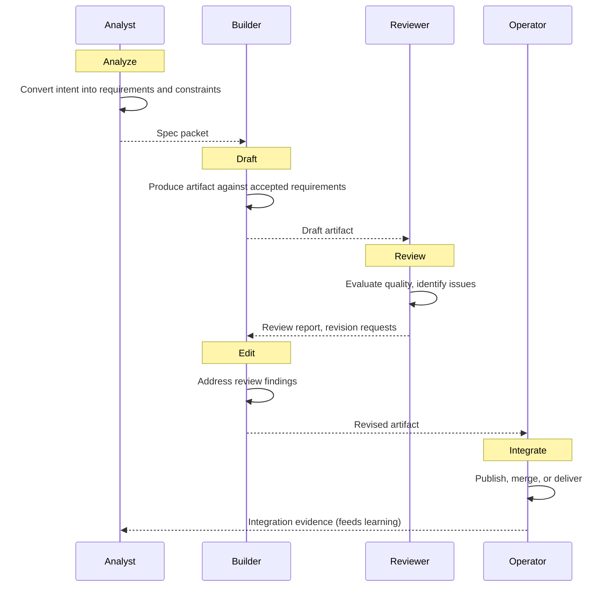

## Specification

### Context

ADREI is a production workflow that executes within the commitment phase of the Deliberation Cycle. It is one implementation pattern for producing artifacts — not the core operating model of the Synthetic Team.

```
Deliberation Cycle
│
├── Decide → "We will build X"
│
└── Commit → ADREI (Analyze → Draft → Review → Edit → Integrate)
```

### Flow



### Phase Details

**Phase 1 — Analyze (Analyst):**
- Convert intent into explicit requirements and constraints
- Define acceptance criteria
- Identify dependencies and risks
- Gate: requirements_accepted — requirements are testable and agreed

**Phase 2 — Draft (Builder):**
- Produce the artifact against accepted requirements
- First version — not expected to be final
- Respect constraints defined during analysis

**Phase 3 — Review (Reviewer):**
- Evaluate quality, maintainability, completeness
- Identify defects and improvement areas
- Gate: review_pass — artifact meets minimum quality bar

**Phase 4 — Edit (Builder):**
- Address review findings
- Revise the artifact
- May require multiple edit cycles
- Gate: edit_complete — all critical findings addressed

**Phase 5 — Integrate (Operator):**
- Publish, merge, submit, or deliver the final artifact
- Record the integration in organizational memory
- Feed outcomes back into the Deliberation Cycle

### When to Use ADREI

ADREI is appropriate when the output is an artifact:
- Article, report, or documentation
- Code or software component
- Design or specification
- Analysis or research output

ADREI is not appropriate when the team is:
- Evaluating options without producing an artifact
- Building consensus or deciding priorities
- Monitoring execution or assessing risk

In those cases, use the Deliberation Cycle directly.

### Role Sequence

```
Analyst → Builder → Reviewer → Builder → Operator
```

The Builder appears twice (Draft and Edit) but with different authority:
- Draft: produce first version against requirements
- Edit: address review findings within scope
