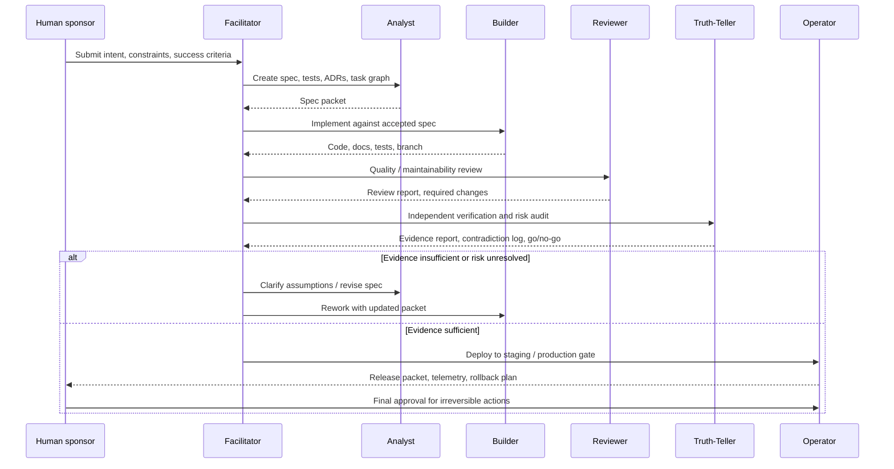

## Specification

### Flow



### Role Sequence

```
Human → Facilitator → Analyst → Builder → Reviewer → Truth-Teller → Operator → Human
```

### Gate Logic

- If `review_pass` fails → return to Builder with Reviewer findings
- If `truth_pass` fails → return to Analyst or Builder with Truth-Teller findings
- If `human_approval` withheld → return to Facilitator for resolution
- All gates must pass for production release

### Continuous Role

The Facilitator maintains continuity across all stages. The Facilitator does not hold stage authority but ensures handoffs complete, state is preserved, and escalations reach the human sponsor.
