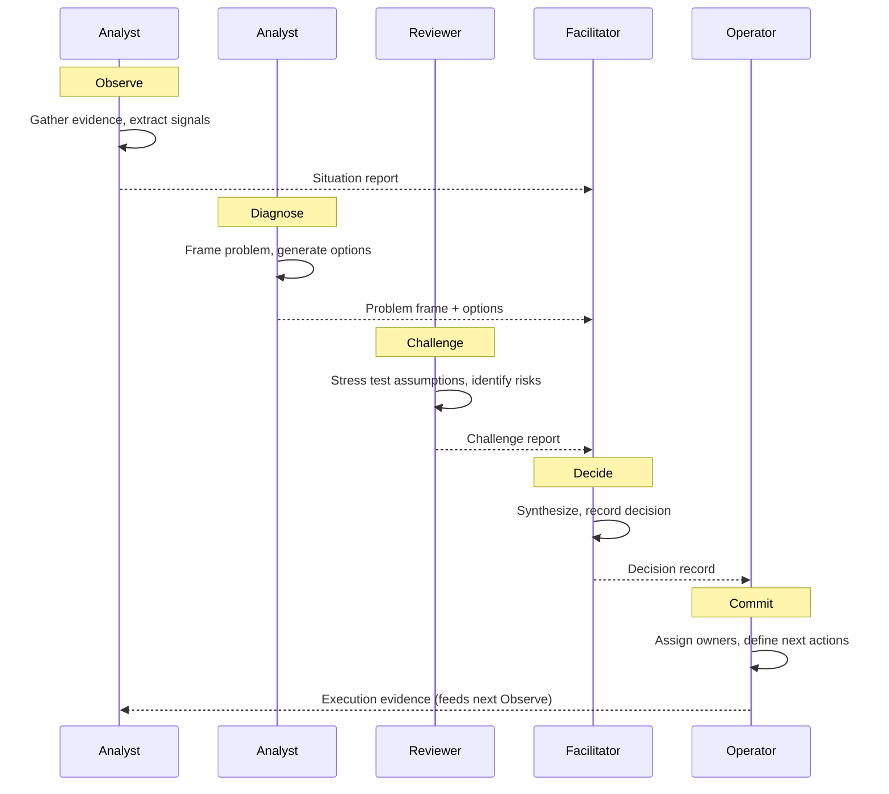

## Specification

### Flow



### Phase Details

**Phase 1 — Observe (Analyst):**
- Gather evidence and structure it
- Extract signals from available data
- Identify what is known and unknown
- Gate: evidence_sufficient — evidence must be structured enough for diagnosis

**Phase 2 — Diagnose (Analyst + Truth-Teller):**
- Frame the problem
- Generate and evaluate options
- Identify root causes and leverage points
- Truth-Teller verifies factual basis of diagnosis

**Phase 3 — Challenge (Reviewer):**
- Stress test assumptions underlying each option
- Identify hidden risks, contradictions, and blind spots
- Ensure recommendations have survived internal challenge
- Gate: challenge_satisfied — all critical assumptions tested

**Phase 4 — Decide (Facilitator):**
- Synthesize input from all roles
- Record decision with rationale, alternatives considered, and criteria applied
- Produce decision record artifact
- Gate: decision_recorded — decision is documented and auditable

**Phase 5 — Commit (Operator):**
- Translate decision into accountable execution
- Assign owners and define next actions
- Feed execution evidence back into Observe for continuous learning

### Governance

Every decision must satisfy JOA/JOAT:
- **Justifiable** — Can the reasoning be articulated?
- **Observable** — Can the inputs and outputs be inspected?
- **Auditable** — Can the decision be traced and challenged?
- **Trustworthy** — Does it meet the governance standard?

### Role Sequence

```
Analyst → Analyst (Diagnose) → Reviewer → Facilitator → Operator
```

### Gate Logic

- If `evidence_sufficient` fails → Analyst continues gathering
- If `challenge_satisfied` fails → Return to Diagnose with challenge findings
- If `decision_recorded` withheld → Return to Facilitator for resolution
- All gates must pass for commitment
